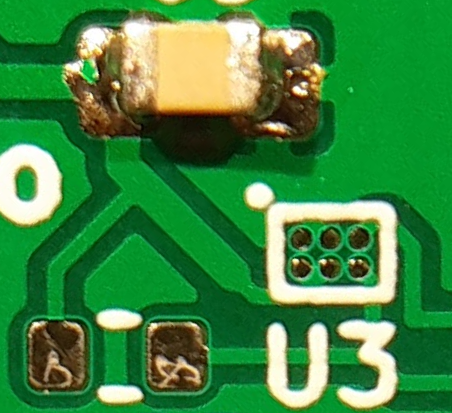

# Low power wireless thermometer

Since 2015 I've had an ["MCP9808"](https://ww1.microchip.com/downloads/en/DeviceDoc/25095A.pdf) I²C temperature sensor attached to a Raspberry Pi, which renders temperature graphs and makes them available on a web server. The MCP9808 is unusually accurate, quoted at ±0.25°C error but often within ±0.1°C, at room temperature and with a 3.3V supply. With some averaging of readings, temperature changes of less than 0.05°C are clearly resolved.

I soon wanted to add temperature measurements elsewhere in the house, using battery-powered sensors that connect to the RPi wirelessly. Ideally I was looking for:
- a battery life of a few years from a single CR2032 battery
    - Nominal capacity of a CR2032 is around 200mAh, over a discharge from ~2.9V to 2.6V. For a three-year battery life this gives an average current budget of about 8μA. 
- accuracy of better than ±0.1°C
- radio communication through some cheap ["NRF24L01+"](https://www.nordicsemi.com/products/nrf24-series) clone boards that I already had from eBay
- low cost

## Temperature sensor
A disadvantage of the MCP9808 is that it has a minimum supply voltage of 2.7V, on the high side for a CR2032. Furthermore, it achieves its accuracy only at 3.3V supply, with quite a strong variation in reading with supply voltage (up to about 0.5°C/V). A low-power boost converter (such as the ["MCP16251"](https://www.microchip.com/en-us/product/MCP16251)) would therefore be required. In 2022, this was a moot point because the MCP9808 was largely out of stock. 

However, a new I²C temperature sensor, the ["AS6221"](https://ams.com/en/as6221), was available, with ±0.09°C max error over supply voltage of 1.7V to 3.6V, and a much lower supply current (6μA vs 200μA) too. The one disadvantage for a DIY project is that it is only available in a 6-pin WLCSP ('wafer level chip scale package'), measuring 1×1.5mm.

## Microcontroller

## Radio

The internal resistance of a CR2032 starts around 15Ω, rising past 50Ω as the battery nears the end of its life; consequently peak current draw should ideally be <2mA.
