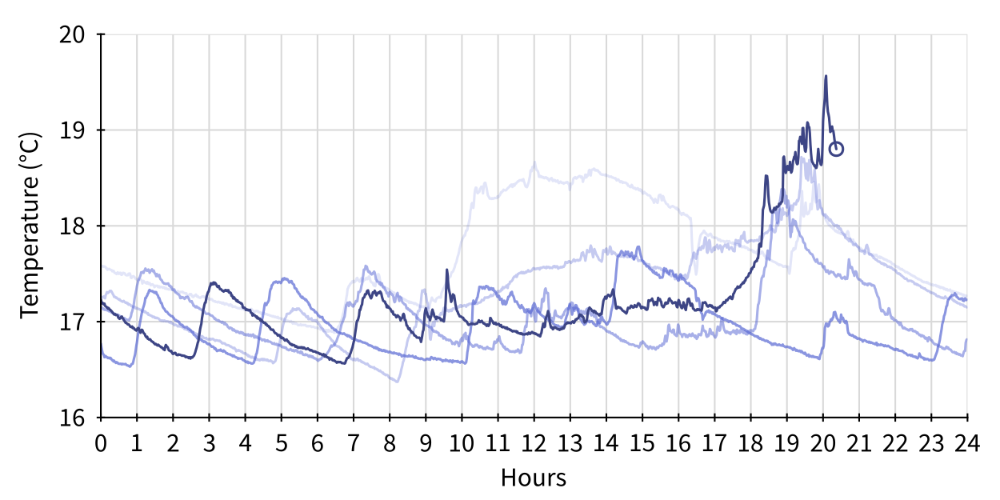
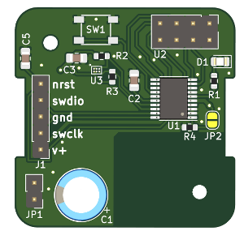

# Low power wireless thermometer

Since 2015 I've had an [MCP9808](https://ww1.microchip.com/downloads/en/DeviceDoc/25095A.pdf) I²C temperature sensor attached to a Raspberry Pi, which renders temperature graphs and makes them available on a web server. The MCP9808 is unusually accurate, quoted at ±0.25°C error but often within ±0.1°C, at room temperature and with a 3.3V supply. With some averaging of readings, temperature changes of less than 0.05°C are clearly resolved.

I soon wanted to add temperature measurements elsewhere in the house, using battery-powered sensors that connect to the RPi wirelessly. Ideally I was looking for:
- a battery life of a few years from a single CR2032 battery
    - Nominal capacity of a CR2032 is around 200mAh, over a discharge from ~2.9V to 2.6V. For a three-year battery life this gives an average current budget of about 8μA. The internal resistance of a CR2032 starts around 15Ω, rising past 50Ω as the battery nears the end of its life; consequently peak current draw should ideally be <2mA.
- accuracy of better than ±0.1°C
- radio communication through some cheap (~£1) [NRF24L01+](https://www.nordicsemi.com/products/nrf24-series) clone boards that I already had from eBay
- low cost

## Temperature sensor
A disadvantage of the MCP9808 is that it has a minimum supply voltage of 2.7V, on the high side for a CR2032. Furthermore, it achieves its accuracy only at 3.3V supply, with quite a strong variation in reading with supply voltage (up to about 0.5°C/V). A low-power boost converter (such as the [MCP16251](https://www.microchip.com/en-us/product/MCP16251)), switched on only when needed, would therefore be required. In 2022, this was a moot point because the MCP9808 was largely out of stock. 

However, a new I²C temperature sensor, the [AS6221](https://ams.com/en/as6221), was available, with ±0.09°C max error over supply voltage of 1.7V to 3.6V, and a much lower supply current (6μA vs 200μA) too. The one disadvantage for a DIY project is that it is only available in a 6-pin WLCSP ('wafer level chip scale package'), which is dwarfed by an 0805 capacitor:

This turned out to be surprisingly easy to solder, using hot air with liquid flux added to the pads beforehand. The WLCSP package 'settles' by a barely perceptable amount as the solder balls melt. I found it useful to place a tiny length of lead-free solder close by to get an indication of when the board was at reflow temperature.

## Microcontroller
The microcontroller does not have to do a lot: sit in a low power sleep mode for some time, before waking up, acquiring a reading from the temperature sensor (I²C), sending it to the radio (SPI), and going back to sleep again. I used an [STM32L031](https://www.st.com/en/microcontrollers-microprocessors/stm32l031e6.html), one of the few STM32 parts available in 2022. A low-power 8-bit PIC should work fine, at about half the price. The STM32L0 series have various low power modes, and the most suitable here was the 'Stop mode' which draws 0.68μA with the real time clock active. ('Standby mode' is even lower power, but has the disadvantage that all IO pins go to high impedance - which then requires external pull-down resistors to avoid the high current consumption (10s to 100s of μA) caused by floating CMOS inputs.)

## Radio
This project was partly designed to use up some the NRF24L01+ boards that I already had. These are 2.4GHz radios, with quite a sophisticated radio protocol designed for much higher bandwidth communication than the few bytes per minute required. Their range is just satisfactory for the task (particularly with a 'NRF24L01+PA+LNA' board for the receiver), but range does vary depending on local 2.4GHz WiFi activity. The NRF24L01+ boards operate from 1.9V-3.6V and have a 0.9uA sleep mode, well suited to a CR2032. The transmit current of 12mA is lower than many radios but nonetheless higher than ideal for a CR2032. A low leakage electrolytic (Nichicon UKL series, 220uF) is therefore added in parallel with the battery, to supply much of the peak current. The NRF24L01+ can re-send messages that are not acknowledged, resulting in a transmit time of 1ms-15ms depending on the number of retransmissions required.

## Construction
The PCB is designed to fit into a [Hammond 1551V1BK](https://www.hammfg.com/part/1551V1BK), a nice vented enclosure of about the ideal size (4×4×2cm). With some shortening of its pin headers, the NRF24L01+ board fits above the main PCB. The range does seem to be improved if conductors are kept >1cm away from the NRF24L01+ antenna.

## Power consumption
The measured standby consumption is 1.7μA, excluding the leakage current for the electrolytic capacitor, which is specified at 1.3μA max. Standby consumption is therefore <3μA. Power consumption when active is dominated by the radio transmission current of 12mA over 1ms-15ms. Using a wake-up interval of one minute, active power consumption is therefore 0.2μA-3μA depending on how many retransmissions are required. Worst case average power consumption is therefore 6μA, giving a ~4 year theoretical battery life.
